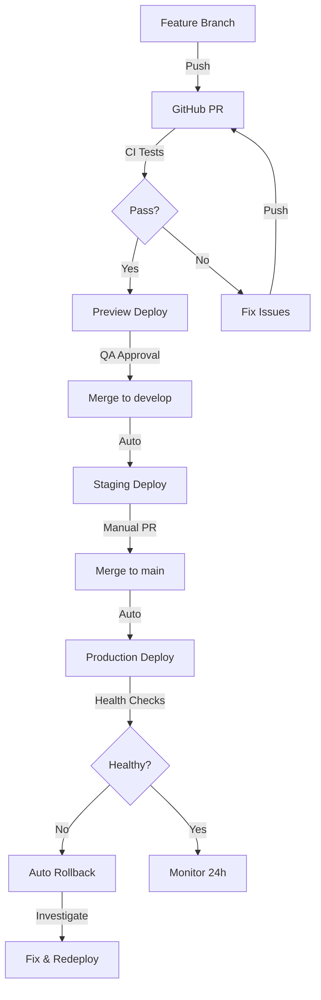

# Deployment & CI/CD Guide - Complete Index

Guia completo e documentação centralizada para deployment e CI/CD do projeto P2P com Next.js 15.

---

## 📚 Documentos Criados

### 1. **DEPLOYMENT_CICD_GUIDE.md** (Guia Principal)
   - Vercel Deployment Configuration
   - GitHub Actions Workflows
   - Database Migrations Strategy
   - Environment Promotion
   - Health Checks Implementation
   - Preview Deployments
   - Rollback Strategies
   - Monitoring Setup
   - Exemplo completo end-to-end

   **Para quem**: Developers que precisam entender todo o pipeline
   **Tamanho**: ~1500 linhas de documentação + código

### 2. **CI_CD_CONFIG_EXAMPLES.md** (Exemplos Prontos)
   - GitHub Actions workflows prontos para copiar
   - Configuration files (vercel.json, scripts)
   - Environment variable setup
   - Health check scripts
   - Package.json scripts

   **Para quem**: DevOps/Developers implementando CI/CD
   **Tipo**: Copy-paste ready examples

### 3. **DEPLOYMENT_CHECKLIST.md** (Checklists)
   - Pre-deployment checklist (1-2 dias antes)
   - Deployment day checklist
   - Common issues & troubleshooting
   - Incident response procedures
   - Post-deployment verification
   - Rollback decision tree

   **Para quem**: QA/Deployment person executando deploy
   **Tipo**: Practical step-by-step guides

### 4. **CI_CD_QUICK_REFERENCE.md** (Referência Rápida)
   - Command cheat sheet
   - Environment variables quick lookup
   - Common tasks & solutions
   - Status checks quick commands
   - Troubleshooting flowchart
   - Decision guides

   **Para quem**: Anyone who needs quick answers
   **Tipo**: Quick lookup reference

---

## 🎯 Como Usar Estes Documentos

### Cenário 1: Implementando CI/CD pela primeira vez

```
1. Leia: DEPLOYMENT_CICD_GUIDE.md (Seções 1-3)
2. Copie: CI_CD_CONFIG_EXAMPLES.md (GitHub Workflows)
3. Configure: Vercel Project + GitHub Secrets
4. Teste: Local build e preview deployment
```

### Cenário 2: Fazendo um deployment

```
1. Use: DEPLOYMENT_CHECKLIST.md (Pre-Deployment)
2. Monitore: CI_CD_QUICK_REFERENCE.md (Health Checks)
3. Se erro: DEPLOYMENT_CHECKLIST.md (Troubleshooting)
4. Pós-deploy: DEPLOYMENT_CHECKLIST.md (Post-Deployment)
```

### Cenário 3: Precisa de um comando específico

```
1. Vá para: CI_CD_QUICK_REFERENCE.md
2. Procure: Command Cheat Sheet ou Troubleshooting
3. Execute: O comando apropriado
```

### Cenário 4: Debugando um problema

```
1. Vá para: DEPLOYMENT_CHECKLIST.md
2. Seção: Troubleshooting (filtrada por tipo de erro)
3. Siga: Solução passo-a-passo
4. Se não resolver: Escalate via contatos listados
```

---

## 🏗️ Arquitetura CI/CD

```
Local Development
    ↓
Git Push to Feature Branch
    ↓
GitHub Pull Request
    ├─ CI Tests (test.yml)
    │  ├─ npm run lint
    │  ├─ npm run type-check
    │  └─ npm run build
    ├─ Security Checks
    │  └─ npm audit
    └─ Preview Deploy (vercel)
    ↓
Code Review + Approval
    ↓
Merge to develop/main
    ↓
┌─ If merge to develop:
│  └─ Deploy to Staging (deploy-staging.yml)
│     ├─ Run migrations
│     ├─ Build
│     ├─ Deploy Vercel preview
│     └─ Health checks
│
└─ If merge to main:
   └─ Deploy to Production (deploy-production.yml)
      ├─ Pre-deployment checks
      ├─ Run database migrations
      ├─ Build
      ├─ Deploy Vercel production
      ├─ Health checks
      └─ Monitoring + Alerts
```

---

## 📋 Quick Start (5 minutos)

### 1. Configure GitHub Secrets

```bash
# Add via GitHub CLI
gh secret set VERCEL_TOKEN --body "seu_vercel_token"
gh secret set VERCEL_ORG_ID --body "seu_org_id"
gh secret set VERCEL_PROJECT_ID --body "seu_project_id"
gh secret set STAGING_DATABASE_URL --body "postgresql://..."
gh secret set PRODUCTION_DATABASE_URL --body "postgresql://..."
gh secret set SLACK_WEBHOOK --body "https://hooks.slack.com/..."
```

### 2. Create Workflow Files

```bash
mkdir -p .github/workflows
# Copy files from CI_CD_CONFIG_EXAMPLES.md
```

### 3. Configure vercel.json

```bash
# Copy vercel.json from CI_CD_CONFIG_EXAMPLES.md
cp CI_CD_CONFIG_EXAMPLES.md vercel.json
```

### 4. Test Locally

```bash
npm run build          # Build test
npm run validate-env   # Env validation
npm run health-check   # Health endpoint test
```

### 5. Push & Watch

```bash
git push origin feature-branch
# Watch GitHub Actions run automatically
```

---

## 🔑 Key Concepts

### Staging vs Production

| Aspecto | Staging | Production |
|---------|---------|-----------|
| **URL** | staging-api.p2p.app | api.p2p.app |
| **Database** | Staging DB | Production DB (backed up) |
| **Trigger** | Auto push to `develop` | Manual dispatch or push to `main` |
| **Risk** | Baixo | Alto (requer checklist) |
| **Downtime** | OK (mínimo) | NÃO permitido |

### Environment Promotion Flow

```
Development (Local)
    ↓
Staging (QA testing)
    ↓
Production (Live users)

Rollback always possible at each stage
```

### Database Migration Strategy

```
1. Write migration + rollback script
2. Test locally (npm run migrate)
3. Test in staging
4. Automatic migration in production (with rollback available)
5. Monitor logs for any issues
```

---

## ✅ Implementation Checklist

### Phase 1: Infrastructure Setup (Day 1)

- [ ] Create Vercel project
- [ ] Connect GitHub repository
- [ ] Set up GitHub Secrets
- [ ] Create GitHub workflows (.github/workflows/)
- [ ] Configure vercel.json
- [ ] Set up Sentry for error tracking
- [ ] Configure Slack webhooks

### Phase 2: Testing & Verification (Day 2-3)

- [ ] Test preview deployments with PRs
- [ ] Test staging deployment
- [ ] Verify health checks
- [ ] Test rollback procedures
- [ ] Load test staging environment
- [ ] Verify monitoring & alerts

### Phase 3: Documentation (Day 4)

- [ ] Create runbook for deployments
- [ ] Document team contacts/escalation
- [ ] Create incident response procedures
- [ ] Train team on CI/CD process

### Phase 4: First Production Deploy (Day 5)

- [ ] Follow DEPLOYMENT_CHECKLIST.md
- [ ] Have team standing by
- [ ] Monitor closely for 24 hours
- [ ] Document any issues
- [ ] Celebrate! 🎉

---

## 🐛 Common Pitfalls & Solutions

| Problema | Causa | Solução |
|----------|-------|---------|
| Build fails with ERESOLVE | npm conflicts | `npm ci --legacy-peer-deps` |
| NEXT_PUBLIC vars undefined | Env var not set | Check Vercel dashboard |
| Health check fails | Service down | Check Sentry + logs |
| Database migration error | Schema mismatch | Rollback + investigate |
| Slow response times | Too many requests | Add caching or scale |
| CORS errors | Wrong origin | Check headers config |

---

## 📊 Monitoring & Observability

### Tools Used

1. **Vercel** - Hosting & deployments
2. **GitHub Actions** - CI/CD pipeline
3. **Sentry** - Error tracking
4. **PostgreSQL** - Database with migration tracking
5. **Slack** - Notifications & team communication

### Key Metrics to Monitor

```
Health Check Endpoint
├─ Response time (target: < 1s)
├─ Database latency
├─ Memory usage
└─ Error rate

Application Performance
├─ Page load time
├─ API response time
├─ Database query time
└─ Error rate by endpoint

Deployment Metrics
├─ Deployment frequency
├─ Lead time for changes
├─ Mean time to recovery (MTTR)
└─ Change failure rate
```

---

## 📞 Getting Help

### For Quick Answers
→ **CI_CD_QUICK_REFERENCE.md**

### For Implementation Details
→ **DEPLOYMENT_CICD_GUIDE.md**

### For Copy-Paste Examples
→ **CI_CD_CONFIG_EXAMPLES.md**

### For Deployment Procedures
→ **DEPLOYMENT_CHECKLIST.md**

### For Troubleshooting
→ **DEPLOYMENT_CHECKLIST.md** (Troubleshooting section)

---

## 🔗 Related Documentation

These guides complement:
- **NEXTJS_15_BEST_PRACTICES.md** - Next.js patterns
- **ENV_VARIABLES_SECURITY_GUIDE.md** - Environment configuration
- **NEXTJS_15_CONFIGURATION.md** - Next.js setup

---

## 📈 Performance Targets

```
Build Time:           < 5 minutes
Deploy Time:          < 2 minutes
Health Check:         < 1 second
Page Load:            < 3 seconds
API Response:         < 500ms
Database Query:       < 100ms
```

---

## 🚀 Deployment Flow Summary



---

## 📚 Documentation Versions

| Documento | Versão | Data | Atualização |
|-----------|--------|------|------------|
| DEPLOYMENT_CICD_GUIDE.md | 1.0.0 | Nov 2025 | Inicial |
| CI_CD_CONFIG_EXAMPLES.md | 1.0.0 | Nov 2025 | Inicial |
| DEPLOYMENT_CHECKLIST.md | 1.0.0 | Nov 2025 | Inicial |
| CI_CD_QUICK_REFERENCE.md | 1.0.0 | Nov 2025 | Inicial |
| DEPLOYMENT_GUIDE_INDEX.md | 1.0.0 | Nov 2025 | Inicial |

---

## 💡 Pro Tips

1. **Always test locally first**: `npm run build && npm run validate-env`
2. **Keep migrations reversible**: Always create rollback scripts
3. **Monitor for 24h after deploy**: Errors can appear after some time
4. **Document everything**: Future you will thank present you
5. **Practice rollbacks**: Know how to do it before you need to
6. **Communicate early**: Tell team about deploys in advance
7. **Gradual rollout**: Consider canary deployments for big changes

---

## 🎓 Learning Path

### Week 1: Understand
- Read DEPLOYMENT_CICD_GUIDE.md (overview sections)
- Understand the flow: Local → Staging → Production
- Read about GitHub Actions basics

### Week 2: Implement
- Copy configuration files (CI_CD_CONFIG_EXAMPLES.md)
- Set up GitHub Secrets
- Configure vercel.json
- Test preview deployments

### Week 3: Test
- Deploy to staging
- Follow DEPLOYMENT_CHECKLIST.md
- Practice rollback procedures
- Verify monitoring & alerts

### Week 4: Master
- Execute production deployments
- Handle incident responses
- Optimize performance
- Document team processes

---

## 📝 Notes

- Todos os exemplos de código estão prontos para usar
- Adapte URLs (staging-api.p2p.app, api.p2p.app) conforme necessário
- Mantenha secrets seguros (nunca commit)
- Atualize documentação conforme mudanças
- Treinar todo o time sobre o processo

---

## Contact & Support

Para dúvidas ou melhorias a esta documentação:
1. Abra uma issue no GitHub
2. Crie uma PR com melhorias
3. Discuss com o time no Slack

---

**Versão**: 1.0.0
**Última atualização**: Novembro 2025
**Projeto**: P2P Compra de Criptomoedas
**Status**: ✅ Pronto para usar
